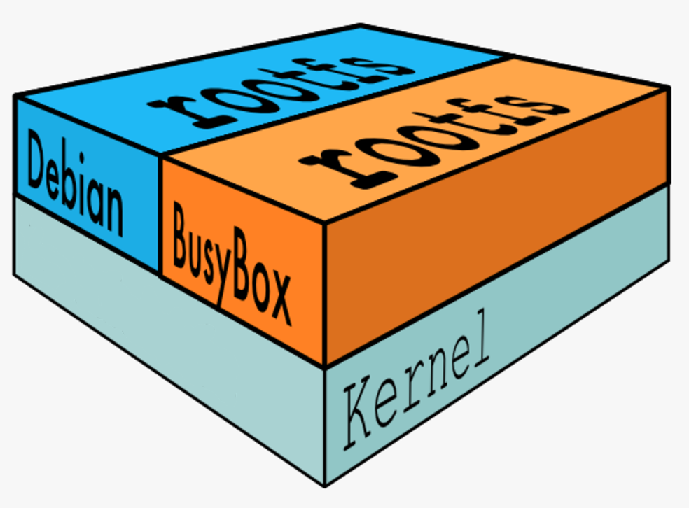
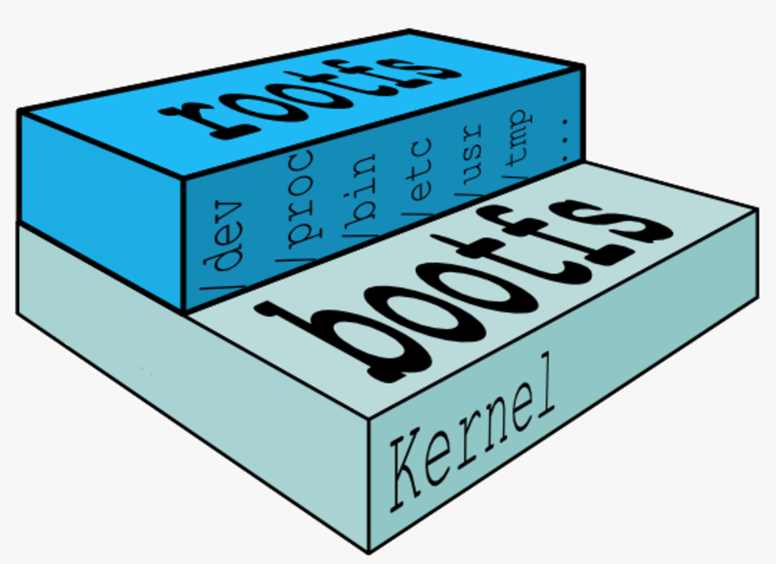
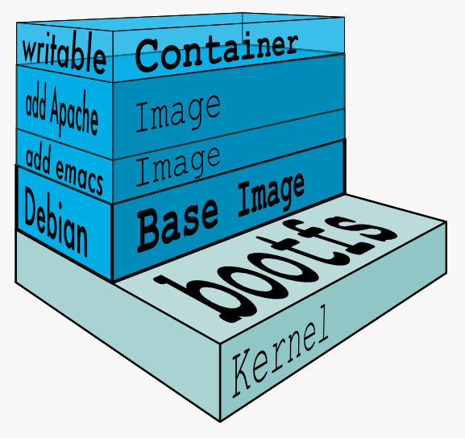
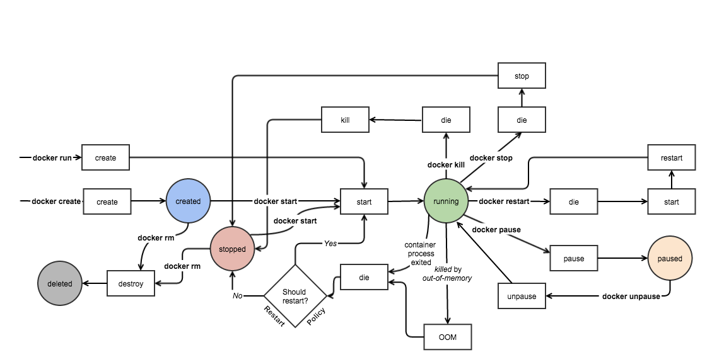

####版本
* CE免费开源
* EE收费
####安装 `Ubuntu18.04安装`
#####ubunbtu仓库下载安装
1. $ sudo apt install docker.io  
2. $ sudo systemctl start docker  
3. $ sudo systemctl enable docker 

#####Docker仓库下载安装：
	电脑需要能够访问：https://download.docker.com/linux/ubuntu

1. $ sudo apt update  
2. $ sudo apt install apt-transport-https ca-certificates curl software-properties-common  
3. deb [arch=amd64] https://download.docker.com/linux/ubuntu bionic stable  
4. $ curl -fsSL https://download.docker.com/linux/ubuntu/gpg | sudo apt-key add -   `添加密钥`
5. sudo apt install docker-ce  

运行docker
docker run -d -p 80:80 httpd
	这会从docker hub仓库下载镜像（如果没有的话），httpd镜像已安装好了Apache HTTP Server
	"80:80"将容器的80端口映射到宿主机的80端口
	加上-name参数为容器指定名称
docker pull 下载镜像

socker run -it centos启动并进入容器
不加-it容器会立即退出
当 CMD 或 Entrypoint 或 docker run 命令行指定的命令运行结束时，容器停止。

容器在 docker host 中实际上是一个进程
run 是docker create 和 docker start的组合

--restart
	always:无论容器因何种原因退出（包括正常退出），就立即重启
	on-failure:3:如果启动进程退出代码非0，则重启容器，最多重启3次
docker stop 或docker kill不会自动重启

浏览器输入:http://127.0.0.1:80

使用国内镜像daocloud.io

docker ps 查看运行中的容器
docker container ls -a (-a显示所有状态的容器)
docker stop  "容器ID" 向容器进程发送一个 SIGTERM 信号
docker kill 命令，其作用是向容器进程发送 SIGKILL 信号。
docker image ls 镜像列表
docker stop ""暂停容器
docker rm ""删除容器
docker start 会保留容器的第一次启动时的所有参数
docker restart 可以重启容器，其作用就是依次执行 docker stop 和docker start。

所有容器共享一个Host OS
Docker 可以将任何应用及其依赖打包成一个轻量级、可移植、自包含的容器。容器可以运行在几乎所有的操作系统上。

容器环境与host环境隔离

Client/Server架构

Client
	docker build
	docker pull
	docker run
DOCKER_HOST
	Docker daemon（服务器组件）-》从Registry下载镜像
		创建、运行、监控容器
		构建、存储镜像
	Images本地镜像
	Containers
	
Docker daemon允许远程客户端请求：
	配置文件：/etc/systemd/system/multi-user.target.wants/docker.service
	ExecStart后面加-H tcp://0.0.0.0(允许任意ip客户端连接)
	重启
	
	客户端连接：命令行后面-H "服务器IP地址"
	
容器启动过程：
Docker 客户端执行 docker run 命令。

Docker daemon 发现本地没有 httpd 镜像。

daemon 从 Docker Hub 下载镜像。

下载完成，镜像 httpd 被保存到本地。

Docker daemon 启动容器。

Dockerfile 是镜像的描述文件，定义了如何构建 Docker 镜像

base 镜像有两层含义：

	不依赖其他镜像，从 scratch 构建。

	其他镜像可以之为基础进行扩展。
	
base 镜像提供的是最小安装的 Linux 发行版。

####疑问
底层共用 Docker Host 的 kernel,不是应该共用宿主机的内核吗
如何进入httpd镜像的容器？

base 镜像只是在用户空间与发行版一致，kernel 版本与发型版是不同的。
所有容器都共用 host 的 kernel，在容器中没办法对 kernel 升级

Docker Hub 中 99% 的镜像都是通过在 base 镜像中安装和配置需要的软件构建出来的
多个镜像都从相同base镜像构建来的，那么本地只需要一份base镜像，内存中也只需要运行保存一份base，就可以为所有镜像服务

镜像每一层都可以被共享

####Copy-on-Write 特性
多个镜像共享一份基础镜像，莫个容器修改基础镜像，不会影响其他镜像，修改会被限制在单个容器内

当容器启动时，一个新的可写层被加载到镜像的顶部。
这一层通常被称作“容器层”，“容器层”之下的都叫“镜像层”。
所有对容器的改动 - 无论添加、删除、还是修改文件都只会发生在容器层中。
只有容器层是可写的，容器层下面的所有镜像层都是只读的。

镜像上层路径会覆盖下层路径

添加文件
在容器中创建文件时，新文件被添加到容器层中。

读取文件 在容器中读取某个文件时，Docker 会从上往下依次在各镜像层中查找此文件。一旦找到，立即将其复制到容器层，然后打开并读入内存。

修改文件 在容器中修改已存在的文件时，Docker 会从上往下依次在各镜像层中查找此文件。一旦找到，立即将其复制到容器层，然后修改之。

删除文件 在容器中删除文件时，Docker 也是从上往下依次在镜像层中查找此文件。找到后，会在容器层中记录下此删除操作。

#####创建镜像的方法
	docker commit "容器名" "新镜像名"
1. 运行容器
2. 修改容器
3. 将容器保存为新的镜像

images    显示镜像列表

history   显示镜像构建历史

commit    从容器创建新镜像

build     从 Dockerfile 构建镜像

tag       给镜像打 tag

pull      从 registry 下载镜像

push      将 镜像 上传到 registry

rmi       删除 Docker host 中的镜像（一个镜像对应了多个 tag，只有当最后一个 tag 被删除时，镜像才被真正删除）

rm删除推出的容器
	sudo docker rm -v $(sudo docker ps -aq -f status=exited)
pause 暂停容器工作
unpause恢复运行

search    搜索 Docker Hub 中的镜像
attach "长id"  进入容器   Ctrl+p 然后 Ctrl+q 组合键退出 attach 终端
exec -it "断id" bash

① -it 以交互模式打开 pseudo-TTY，执行 bash，其结果就是打开了一个 bash 终端。

② 进入到容器中，容器的 hostname 就是其 “短ID”。

③ 可以像在普通 Linux 中一样执行命令。ps -elf 显示了容器启动进程while 以及当前的 bash 进程。

④ 执行 exit 退出容器，回到 docker host。

docker exec -it <container> bash|sh 是执行 exec 最常用的方式。

attach 与 exec 主要区别如下:

attach 直接进入容器 启动命令 的终端，不会启动新的进程。

exec 则是在容器中打开新的终端，并且可以启动新的进程。

如果想直接在终端中查看启动命令的输出，用 attach；其他情况使用 exec。

docker logs -f      -f 的作用与 tail -f 类似，能够持续打印输出。
rename

####容器
#####三种方式指定容器启动时执行的命令
CMD 指令。

ENDPOINT 指令。

在 docker run 命令行中指定。

####内存
* 物理     	-m、-memory
* swap 	--memory-swap
######示例 docker run -m 200M --memory-swap=300M ubuntu
	最多使用 200M 的内存和 100M 的 swap
	默认情况下两组参数为-1，内存没有限制
######示例docker run -it -m 200M --memory-swap=300M progrium/stress --vm 1 --vm-bytes 280M
	--vm 1：启动 1 个内存工作线程。
	--vm-bytes 280M：每个线程分配 280M 内存。
如果在启动容器时只指定 -m 而不指定 --memory-swap，那么 --memory-swap 默认为 -m 的两倍
