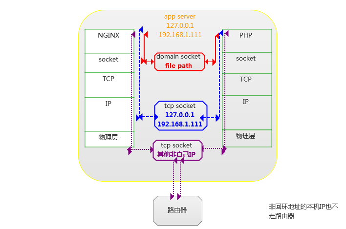

locate(locate) 命令用来查找文件或目录。 locate命令要比find -name快得多，原因在于它不搜索具体目录，而是搜索一个数据库/var/lib/mlocate/mlocate.db 。这个数据库中含有本地所有文件信息。Linux系统自动创建这个数据库，并且每天自动更新一次，因此，我们在用whereis和locate 查找文件时，有时会找到已经被删除的数据，或者刚刚建立文件，却无法查找到，原因就是因为数据库文件没有被更新。为了避免这种情况，可以在使用locate之前，先使用updatedb命令，手动更新数据库。整个locate工作其实是由四部分组成的:

/usr/bin/updatedb   主要用来更新数据库，通过crontab自动完成的

/usr/bin/locate         查询文件位置

/etc/updatedb.conf   updatedb的配置文件

/var/lib/mlocate/mlocate.db  存放文件信息的文件

查找配置文件：locate nginx.conf
1.查看nginx路径:ps -aux|grep nginx
2.查看nginx配置文件路径（找到运行的nginx文件，后面加-t参数）

nginx：日志

error_log ：错误日志
log_format：日志格式
access_log：日志存放地址


access_log /var/log/nginx/access.log;
error_log /var/log/nginx/error.log;


####nginx和phpfpm之间通信是使用tcp socket还是unix socket

tcp socket
允许通过网络进程之间的通信，也可以通过loopback进行本地进程之间通信。

unix socket
允许在本地运行的进程之间进行通信。




unix socket减少不必要tcp开销
tcp需要经过loopback、临时端口、tcp相关资源


unix socket高并发时候不稳定，连接数爆发时，会产生大量的长时缓存，在没有面向连接协议的支撑下，大数据包可能会直接出错不返回异常。tcp这样的面向连接的协议，多少可以保证通信的正确性和完整性。

#####nginx和php-fpm 使用unix socket
```
# cd /dev/shm
touch php7.0-fpm.sock 
chown www-data:www-data php7.0-fpm.sock
chmod 777 php7.0-fpm.sock
```
```
# vi /etc/php/7.0/fpm/pool.d/www.conf
listen= /dev/shm/php7.0-fpm.sock
listen.owner = www-data
listen.group = www-data
```
```
nginx server块配置
location ~* \.php$ {
    fastcgi_pass unix:/dev/shm/php7.0-fpm.sock;
    fastcgi_param SCRIPT_FILENAME $document_root$fastcgi_script_name;
    include /etc/nginx/fastcgi_params;
  }
```


```
1.修改内核参数

net.unix.max_dgram_qlen = 4096
net.core.netdev_max_backlog = 4096
net.core.somaxconn = 4096

2.提高backlog 
backlog默认位128，1024这个值最好换算成自己正常的QPS。

nginx.conf
server{
  listen 80 default backlog=1024;
}

php-fpm.conf
listen.backlog = 1024

3.增加sock文件和php-fpm实例 
在/dev/shm新建一个sock文件，在nginx中通过upstream魔抗将请求负载均衡到两个sock文件， 
并且将两个sock文件分别对应到两套php-fpm实例上。
```


####疑问：
看你搭配的是哪个就用哪个呀，如果你用的是ngnix + fastcgi，那就用php-cgi.sock；如果是ngnix + php-fpm，那就用php-fpm.sock。当然，fpm的效率要比fastcgi高，因为fpm就是一个fastcgi的管理器。
